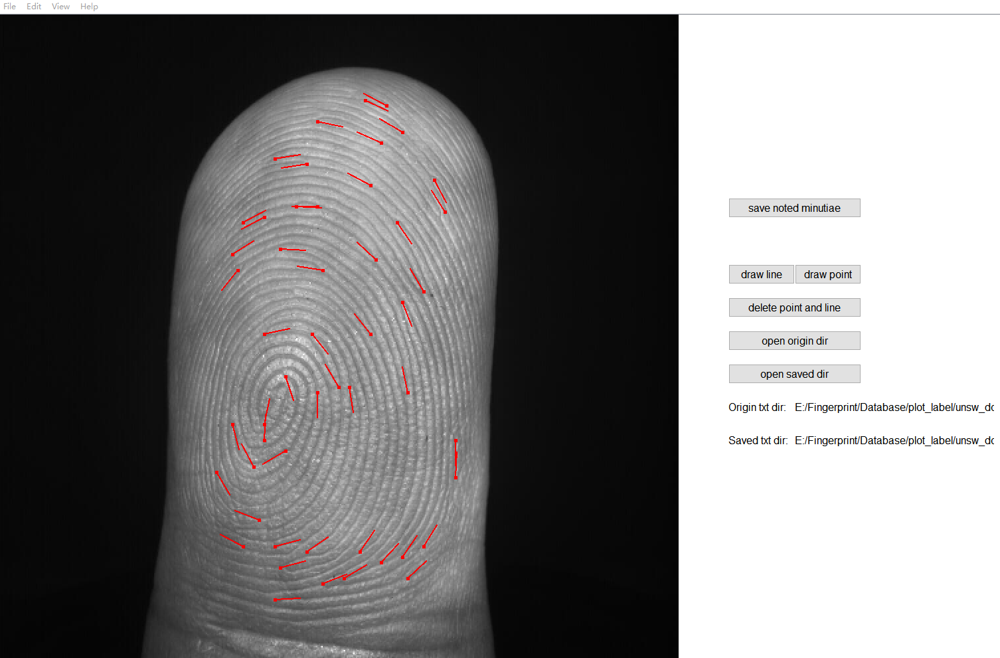

# MinutiaeLabelling

This repository contains a GUI tool based on Qt for labelling minutiae of a fingerprint, which would be used as training samples for a minutiae detection network. Note that this tool will not distinguish ridge endings from bifurcations. Since labelling is time-consuming and labor-intensive, pre-labels would usually be provided by some commercial softwares (e.g., Verifinger).

#### Requirements

- Windows
- Qt 5.12
- MinGW 7.3.0

#### Usage

1. select `origin dir`, which stores the files of pre-labelled files;
2. select `saved dir`, which would save new labels after finishing labelling;
3. open an image which you'd like to label;
4. to label a minutia, click `daw point`; to label the direction of a minutiae, click `draw line` ; to delete false minutiae, click `delete point and line`, and you can draw boxes on the image, minutiae in the box will be removed;
5. after finishing labelling, click `save noted minutiae`, and new labelled minutiae file will be saved in `saved dir`.

